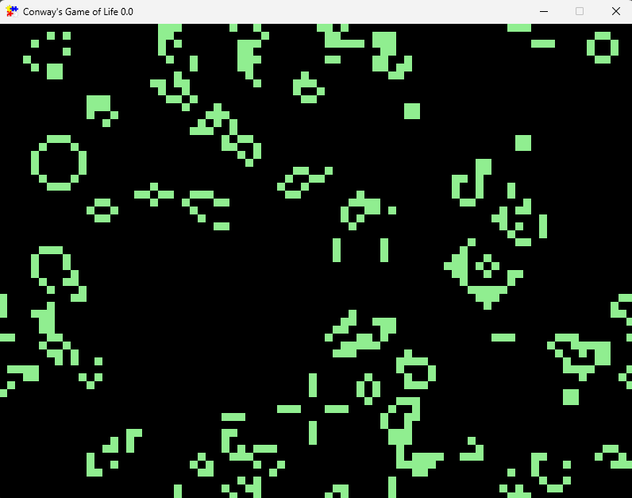

# Conway's Game of Life
Conway's Game of Life is a cellular automaton simulation devised by the British mathematician John Horton Conway. The game is a zero-player game, meaning its evolution is determined by its initial state, requiring no further input. The simulation illustrates the behavior of cells living on a grid, following simple rules that dictate whether cells live, die, or are born.

## Rules
The game consists of a grid of cells, each of which can be either alive or dead. The simulation evolves through discrete time steps, following these rules:
- Any live cell with fewer than two live neighbors dies, as if by underpopulation.
- Any live cell with two or three live neighbors lives on to the next generation.
- Any live cell with more than three live neighbors dies, as if by overpopulation.
- Any dead cell with exactly three live neighbors becomes a live cell, as if by reproduction.

## Description of important files
- Main.java: Located in src/main/java/se/peaccounting/. This file serves as the entry point for the application, launching the GameOfLifeApp.
- GameOfLifeApp.java: Located in src/main/java/se/peaccounting/. This is the main application file containing the game's logic, including the creation of cells, updating their state, and running the simulation.
- GameOfLifeAppTest.java: Located in src/test/java/se/peaccounting/. This file contains tests to verify the correctness of the GameOfLifeApp class.

## Future Improvements and Todos
- Database integration: Save simulation states, allowing users to load and replay their favorite configurations.
- Game server integration: Allow users to share their simulations with others in real-time.
- User input: Enable users to draw their initial configurations or modify the simulation while it's running.
- Buttons and controls: Add buttons to start, stop, and reset the simulation, as well as change its speed.
- Statistics: Display information about the current state of the simulation, such as the number of live cells and the number of generations that have passed.

## Downloading, Compiling, and Executing
#### Download release
If you just want to see the Game of Life in action then
[Download the latest release here.](https://github.com/robertkottelin/GameOfLife/releases/download/v1.0.0/GameOfLife.jar)
You need to have Java Runtime Environment (JRE) installed on your system to run the program. 
Open the file to run the program. 

Or open a terminal, cd into the file's directory and type the command 

`java -jar GameOfLife.jar`

#### Download code and compile program using Maven
1. Open a terminal and clone the GitHub repository to your local machine:
   `git clone https://github.com/yourusername/GameOfLife.git`
2. Navigate to the project directory: `cd GameOfLife`
3. Compile the project using Maven: `mvn clean compile assembly:single`
4. Execute the JAR file: `java -jar target/GameOfLife-1.0-SNAPSHOT.jar`

This will launch the Game of Life simulation.

